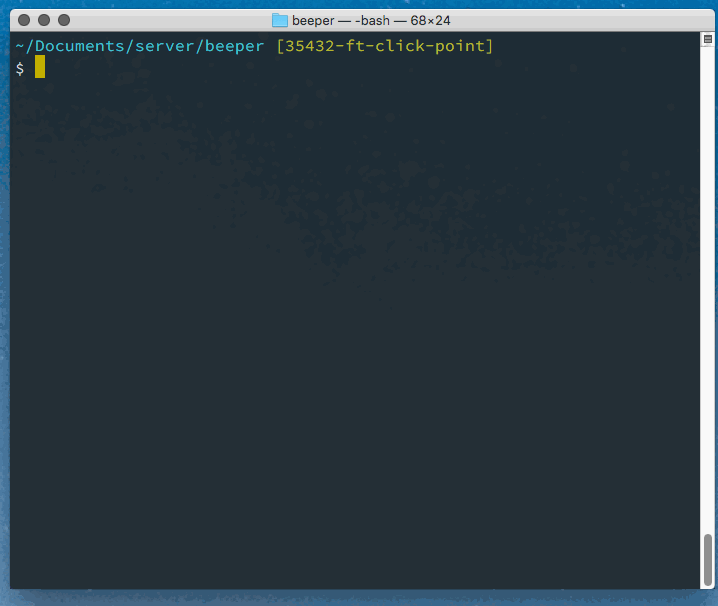

# Scurps
a collection of scripts and other computer schtuff that are helpful

These have been used on a *Nix OS. Install them on your computer [this way](#installing).

## Terminal Helpers

#### ppcc

Copy your current working directory to your clipboard. Think, "paste paste, copy copy", or `ppcc`—that's faster to type than pwdcp (print working directroy copy).

_[see source](./ppcc)_

## Git things

#### gbcc

Copy your current git branch to your clipboard. Similar to `ppcc`, think, "git branch copy copy".

_[see source](./gbcc)_

#### ggb

Cycle through the local branches in a git repo, and copy the branch name of your choice to your clipboard. Look ma, no hands (coming off the keyboard to use the mouse to select the git branch in order to checkout to it, yeah!). Think, "get git branch".



_[see source](./ggb)_

## Prompt Helpers

#### Show current git branch

Everyone has their own choice for their prompt; I like to show my current working directory and, if in a git repo, my current branch. I have the [get_git_branch](./prompt/current-git-branch.sh) function, `git_prompt` in my `bash_profile`, and I've updated my prompt like so:

``` sh
# PROMPT purdiness
PS1='\w $(git_prompt)\n$ '
```

``` prompt
~/Documents/projects/bathroom [master]
$ echo "I am a pretty butterfly"
```

# Installing

With the file on your machine, you'll change it's permissions to be executable, and then move it to your bin of executable goodness.

``` prompt
chmod 755 my_script
cp my_script /usr/local/bin/
```
